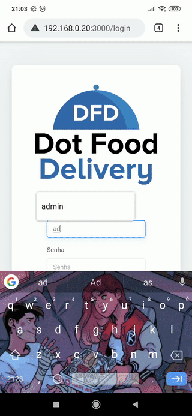

### Front-end Developer
# Latest Projects
## [SHG Advogados](https://github.com/pablogonzalezz/shgadvogados) (Bootstrap landing page)

## [Dot Food Delivery](https://github.com/pablogonzalezz/front-end-dot-food-delivery) (React + Node app)

## [Telegram Clone](https://github.com/pablogonzalezz/telegram-clone) (Electron + Angular app)

# Other stuff
 

  <a href="https://github.com/pablogonzalezz">
  
  

 
  
  
  
  
  
  
  

  
  ##
 

 
  
  
   

